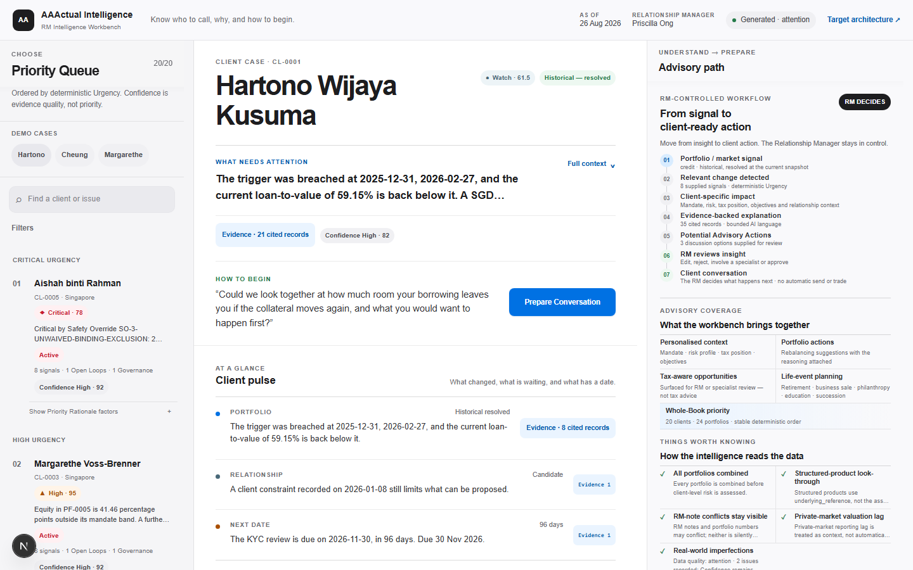
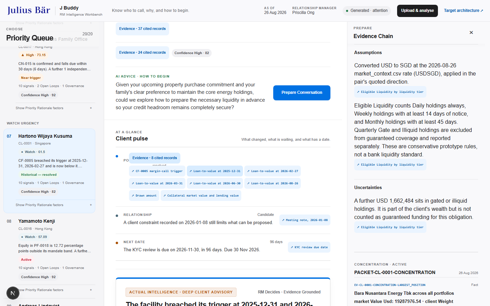
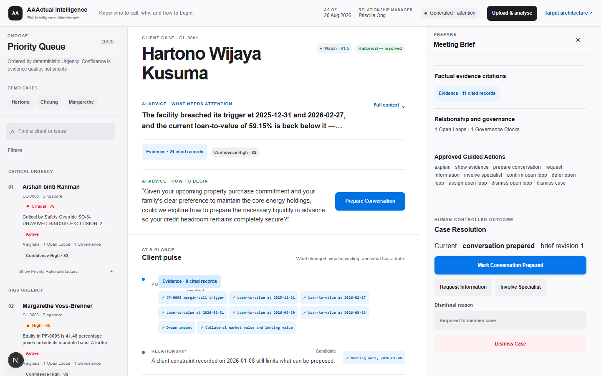

# JB Clarity

> Know who to call, why, and how to begin.

JB Clarity is a wealth intelligence workbench for Relationship Managers. It turns a complex client Book into a clear, evidence-backed plan for the day—without asking the RM to hand judgment over to an AI.

The story starts with Priscilla Ong. She looks after 20 clients across 24 portfolios, with market movements, mandate rules, cash needs, credit facilities, and relationship notes all competing for attention. Traditional portfolio tools show her more data. JB Clarity helps her decide what matters now.



## What the product does

JB Clarity brings four jobs into one calm workflow:

1. **Prioritise the Book.** A deterministic Priority Queue shows which Client Cases need attention first and the visible reasons behind that order.
2. **Understand the client.** Financial signals are combined with objectives, life stage, liquidity needs, and relationship context.
3. **Show the evidence.** Every material claim can be traced through an Evidence Chain to its source record, calculation, or approved event.
4. **Prepare the conversation.** The RM can review, edit, and approve a Meeting Brief and a client-language view. Nothing is sent or traded automatically.

Urgency and Confidence are deliberately separate. A case can be urgent even when some evidence is incomplete, and the uncertainty stays visible instead of being hidden behind a single AI score.

## The three-minute demo

Our live pitch follows one morning in Priscilla’s work:

- **Aishah is ranked first:** a SGD 5.6M mandate breach collides with an AUD 1.45M tuition payment due in six days.
- **Cheung reveals the deeper value:** the system connects his retirement cashflow needs, loss aversion, and a Treasury maturing in 2045 to help Priscilla frame a more human conversation.
- **Evidence earns trust:** source records and deterministic calculations sit behind the insight.
- **Priscilla remains responsible:** she prepares, reviews, and explicitly approves the Meeting Brief.

The full scripts are available in [the roleplay version](web/demo/PITCH-SCRIPT-PRISCILLA-ROLEPLAY.md) and [the three-presenter version](web/demo/PITCH-SCRIPT-3MIN-3PERSON.md).

| Evidence Chain | RM-approved Meeting Brief |
| --- | --- |
|  |  |

## Why it is trustworthy

- **Deterministic where correctness matters.** Python calculates metrics, applies Safety Overrides, and ranks the Book from visible rules.
- **Grounded where language helps.** Optional language generation receives one bounded Evidence Packet at a time and cannot invent new source facts.
- **Human-controlled by design.** The RM can edit, approve, defer, involve a specialist, or dismiss a Client Case with a reason.
- **Safe when offline.** The core demonstration works without a model key or network connection, using validated cached language where available.
- **Honest about uncertainty.** Conflicting sources lower Confidence and remain visible.
- **No autonomous execution.** The prototype has no route for placing a trade or contacting a client.

All client, portfolio, transaction, and RM-note data in this repository is **synthetic and created for the hackathon**. The project still treats it with the care expected of real private-banking data.

## How it works

```text
Synthetic client Book
        ↓
Deterministic intelligence engine
        ↓
Versioned Workbench artifact + Evidence Packets
        ↓
RM Intelligence Workbench
        ↓
Review → Edit → Approve
```

The boundaries are intentional:

| Area | Responsibility |
| --- | --- |
| [`engine/`](engine/) | Data validation, calculations, detectors, Evidence Packets, Urgency, Confidence, and Priority Queue ordering |
| [`contracts/`](contracts/) | Versioned integration contracts shared by the engine and interface |
| [`web/`](web/) | Next.js Command Centre, Client Cases, Evidence Chain, Meeting Brief, upload flow, and demo experience |
| [`control-plane/`](control-plane/) | Separately tested identity, authorization, projection, audit, and approval controls for a target bank environment |
| [`artifacts/`](artifacts/) | Generated Workbench and specialist-intelligence outputs |

The browser presents the artifact; it does not recalculate financial results. The optional language layer explains approved evidence; it does not rank clients or decide what the RM should do.

## Run it locally

You will need Python 3.11 or newer and a recent Node.js/npm installation.

From the repository root:

```bash
python -m venv .venv
source .venv/bin/activate
python -m pip install -e "engine[api,dev]"

cd web
npm ci
npm run dev:full
```

On Windows, activate the environment with `.venv\Scripts\activate` instead. Then open [http://localhost:3000](http://localhost:3000).

Choose **Upload & analyse** to load the supplied canonical CSV/JSON files or a compatible Excel workbook. Gemini is optional; the deterministic intelligence and the complete offline demo do not need an API key.

For a web-only offline demonstration after dependencies are installed:

```bash
cd web
npm run sync-data
npm run build
npm run start
```

## Verify the project

```bash
python -m pytest engine/tests -q
python -m pytest control-plane/tests -q

cd web
npm test
npm run test:e2e
npm run build
```

The test suites cover the financial rules, Evidence Packet integrity, Priority Queue behavior, language validation, security controls, responsive interface, and the complete RM workflow.

## Learn more

- [Product language and principles](CONTEXT.md)
- [Intelligence engine](engine/README.md)
- [RM workbench](web/README.md)
- [Multi-agent intelligence architecture](docs/architecture/multi-agent-intelligence.md)
- [Threat model](docs/THREAT-MODEL.md)
- [Challenge dataset and data dictionary](singhacks-jb-wealth-intelligence/README.md)

JB Clarity is not trying to replace the Relationship Manager. It is designed to make every client conversation more timely, more defensible, and more human.
